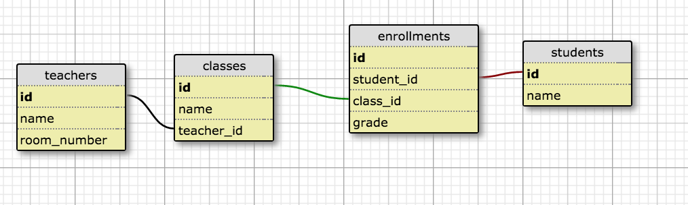
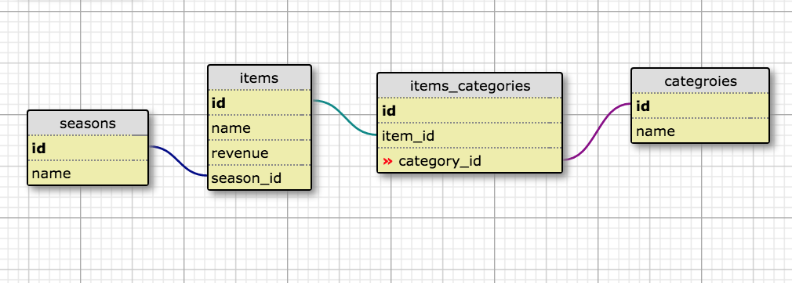

Raw SQL Practice during Turing module break

*** [Intermediate SQL I](https://gist.github.com/case-eee/5affe7fd452336cef2c88121e8d49f5d)  ***

List all the students and their classes
* SELECT students.name, classes.name FROM students JOIN enrollments ON students.id = enrollments.student_id JOIN classes ON classes.id = enrollments.class_id

List all the students and their classes and rename the columns to "student" and "class"
* SELECT students.name AS student, classes.name AS classes FROM students JOIN enrollments ON students.id = enrollments.student_id JOIN classes ON classes.id = enrollments.class_id;

List all the students and their average grade
* SELECT students.name, AVG(enrollments.grade) FROM students JOIN enrollments ON students.id = enrollments.student_id GROUP BY students.name

List all the students and a count of how many classes they are currently enrolled in
* select students.name, COUNT(enrollments.grade) AS class_count FROM students JOIN enrollments on students.id = enrollments.student_id GROUP BY students.name

List all the students and their class count IF they are in more than 2 classes

List all the teachers for each student
* select DISTINCT  students.name, teachers.name AS teachers_name  FROM students JOIN enrollments ON students.id = enrollments.student_id JOIN classes ON classes.id = enrollments.class_id JOIN teachers ON teachers.id = classes.teacher_id ORDER BY students.name;

List all the teachers for each student grouped by each student(need to double check this answer)
* SELECT teachers.name AS teacher_name, students.name AS student_name FROM teachers JOIN classes ON classes.teacher_id = teachers.id JOIN enrollments ON enrollments.class_id = classes.id JOIN students ON students.id = enrollments.student_id GROUP BY teachers.name, students.name;

Find the average grade for a each class
* select classes.name, AVG(enrollments.grade) FROM classes JOIN enrollments ON classes.id = enrollments.class_id GROUP BY classes.name

List students' name and their grade IF their grade is lower than the average.

***[Intermediate SQL II](https://github.com/turingschool/lesson_plans/blob/master/ruby_03-professional_rails_applications/intermediate_sql.md)***

What's the total revenue for all items?
* SELECT sum(revenue) FROM items

What's the average revenue for all items?
* SELECT  AVG(revenue) FROM items

What's the minimum revenue for all items?
* SELECT  MIN(revenue) FROM items

What's the maximum revenue for all items?
* SELECT  MAX(revenue) FROM items

What the count for items with a name?
* SELECT COUNT(items.id) FROM items

Return all main courses
* select items.name, course from items where course = 'main';

Return only the names of the main courses
* select items.name from items where course = 'main';

Return the min and max value for the main courses
* select name, min(revenue), max(revenue) from items where course = 'main' group by name

What's the total revenue for all main courses
* select sum(revenue) from items where course = 'main'

***New tables***

Grab each item and its season using an INNER JOIN
* SELECT * FROM items JOIN seasons ON seasons.id = items.season_id

Only display the name of the item and the season
* SELECT items.name, seasons.name FROM items JOIN seasons on seasons.id = items.season_id;

Write a query that pulls all the category names for arugula salad
* select items.name, categories.name FROM items JOIN item_categories  ON items.id = item_categories.item_id JOIN categories ON categories.id = item_categories.category_id
where items.name = 'arugula salad';

Write a query that displays items that have NULL as their season id
* SELECT * from items left outer join seasons on seasons.id = items.season_id;

Write a WHERE clause that returns the items that have a revenue greater than that average.
* SELECT * FROM items WHERE revenue > (SELECT AVG(revenue) FROM items);

Write a query that returns the sum of all items that have a category of dinner.
 * SELECT SUM(revenue) FROM items JOIN item_categories ON item_categories.item_id = items.id JOIN categories ON categories.id = item_categories.category_id where categories.name = 'dinner';

Write a query that returns the average revenue for each category
* SELECT categories.name, SUM(items.revenue) FROM  categories JOIN item_categories ON categories.id = item_categories.category_id JOIN items ON items.id = item_categories.item_id GROUP BY categories.name;
